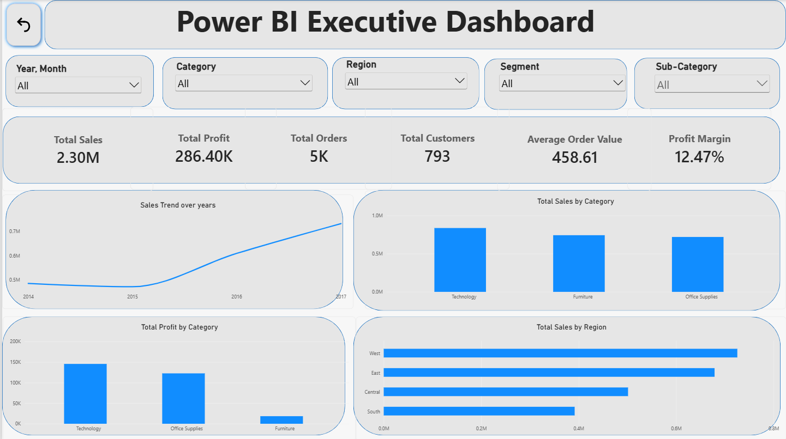

# E-Commerce Sales & Customer Analytics

##  Project Overview

This project focuses on analyzing e-commerce data to understand **sales performance, profitability, customer behavior, product performance, regional performance, and discount patterns**.

The main objective is to identify meaningful business insights and present them through data analysis and an interactive **Power BI dashboard**.

---

##  Business Problem

The project aims to answer questions such as:

* How are sales and profit performing?
* Which categories and sub-categories generate the most sales and profit?
* Which products are highly profitable or loss-making?
* Are the best-selling products also the most profitable?
* Which regions perform better?
* Who are the top customers by sales and profit?
* What is the customer purchasing behavior?
* How does discounting relate to sales and profit?

---

##  Dataset

The project uses the **Kaggle Superstore dataset**.

Key columns include:

`Order ID`, `Customer ID`, `Order Date`, `Ship Date`, `Product Name`, `Category`, `Sub-Category`, `Segment`, `Region`, `Sales`, `Quantity`, `Discount`, and `Profit`.

---

##  Tools & Technologies

* **Excel** — Data cleaning, validation, and initial analysis
* **PostgreSQL / SQL** — Structured business analysis and querying
* **Python** — Exploratory and statistical analysis
* **Pandas & NumPy** — Data manipulation and analysis
* **Matplotlib & Seaborn** — Data visualization
* **Power BI** — Interactive dashboard and business reporting

---

##  Data Cleaning & Preparation

The dataset was relatively clean, but data quality checks were performed before analysis.

The following checks were performed:

* Missing values
* Duplicate records
* Data types
* Date fields
* Sales and quantity values
* Discount values
* Text formatting and unnecessary spaces
* Potential outliers

Potential outliers were documented rather than automatically removed because unusually high values can represent genuine business transactions.

---

##  Project Workflow

```text
Kaggle Superstore Dataset
          ↓
Data Cleaning & Validation
          ↓
Excel Analysis
          ↓
PostgreSQL / SQL Analysis
          ↓
Python EDA & Statistical Analysis
          ↓
Power BI Dashboard
          ↓
Business Insights & Recommendations
```

---

## 📈 Key KPIs

| KPI                 |    Value |
| ------------------- | -------: |
| Total Sales         |  ~$2.30M |
| Total Orders        |    5,009 |
| Total Customers     |      793 |
| Total Profit        |   ~$286K |
| Average Order Value | ~$458.61 |
| Profit Margin       |   12.47% |

---

##  Key Findings

### Sales & Profitability

Higher sales do not necessarily mean higher profit. Some products generated relatively high sales but still recorded negative profit.

### Category Performance

Technology showed the strongest profitability, while Furniture had a significantly lower profit margin.

Furniture generated approximately **$742K in sales** but only around a **2.49% profit margin**.

### Regional Performance

The West region generated the highest sales and profit, while Central had the lowest profit margin among the four regions.

### Product Performance

The **Canon imageCLASS 2200 Advanced Copier** was among the highest-profit products.

The analysis also identified products with relatively high sales but negative profit.

### Customer Analysis

The project analyzed:

* Unique customers
* Repeat customers
* One-time customers
* Purchase frequency
* Average customer spend
* Top customers by sales and profit

Out of **793 unique customers, 781 were repeat customers and 12 were one-time customers**.

### Discount Analysis

Higher discount levels were associated with lower profitability in the observed data. Several high-discount groups showed negative aggregate profit.

However, correlation does **not** prove that discounting alone caused the decrease in profit.

---

##  Statistical Analysis

The project included:

* Mean
* Median
* Standard deviation
* Percentiles
* Correlation analysis

Relationships analyzed included:

* Discount vs Profit
* Discount vs Sales
* Quantity vs Sales
* Sales vs Profit

The focus was on understanding the **business meaning** of the relationships rather than only reporting statistical values.

---

##  Power BI Dashboard

The final Power BI dashboard provides an interactive view of:

* Overall KPIs
* Sales trends
* Profitability
* Category performance
* Regional performance
* Product performance
* Customer analysis
* Discount-related insights

### Dashboard Preview



---

## 💡 Business Recommendations

1. **Focus on profitability, not sales alone**
   Evaluate products and categories using both sales and profit margin.

2. **Investigate low-margin categories and regions**
   Identify the factors contributing to weak profitability.

3. **Review discount strategies**
   Evaluate whether high discounts generate enough additional sales to justify lower margins.

4. **Use customer analysis**
   Consider customer purchasing behavior and repeat purchasing when making customer-focused decisions.

---

##  Limitations

* The dataset contains historical data from **2014–2017**.
* Detailed cost information was not available.
* Correlation does not establish causation.
* Customer behavior analysis was limited to the available fields.
* Discount-level profitability can be influenced by product mix and other factors.

---

##  Project Structure

```text
Ecommerce_Data_Analytics/
│
├── .vscode/
├── 01_Project_Proposal/
├── 02_Raw_Data/
├── 03_Cleaned_Data/
├── 04_Excel_Analysis/
├── 05_SQL/
├── 06_Python/
├── 07_Visualizations/
├── 08_PowerBI/
├── 09_Report/
├── 10_Presentation/
├── images/
│   └── dashboard.png
│
├── .gitignore
└── README.md
```

---

##  Project Outcome

This project demonstrates an end-to-end business analytics workflow using **Excel, SQL, Python, and Power BI**.

The main takeaway is that **higher sales do not necessarily translate into higher profitability**. A complete business analysis should consider sales, profit, profit margin, products, categories, regions, customers, and discounting together.
